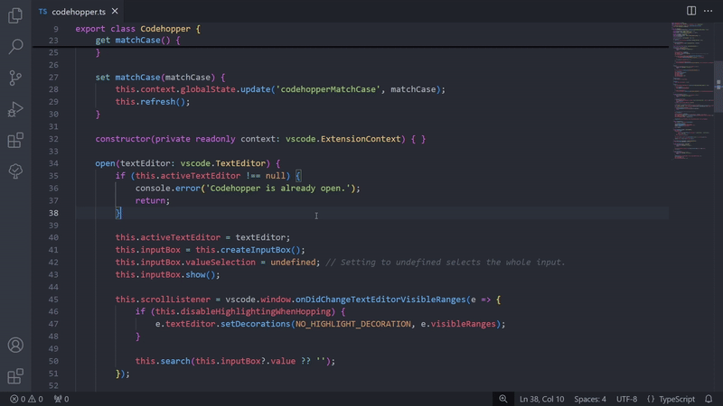
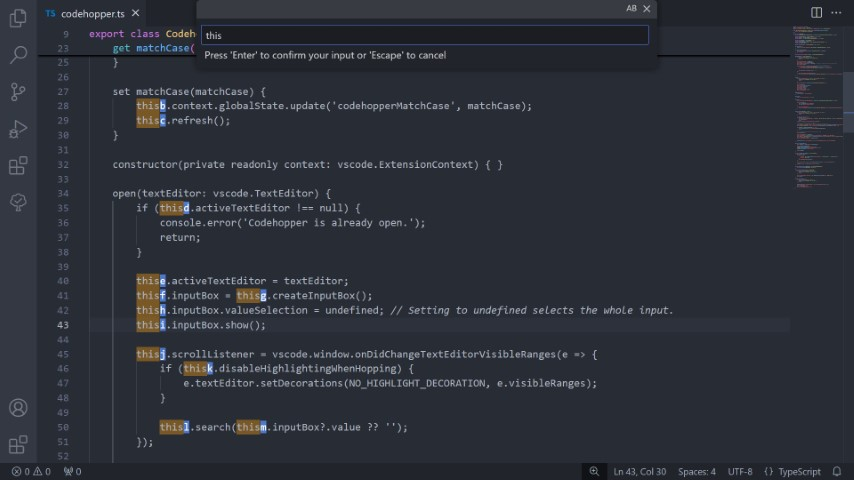

# Codehopper

Codehopper is an extension that improves moving around your code, inspired by [leap.nvim](https://github.com/ggandor/leap.nvim).\
With codehopper you can highlight a segment accross all the visible lines. Each segment gets a unique label based on the characters of highlighted segments.\
This allows you to place the cursor at a specific segment without ever touching the mouse.

## How to use

1. Open the codehopper search using the keyboard shortcut.
    * Windows/Linux: `ctrl+' ctrl+'`
    * Mac: `cmd+' cmd+'`
2. Start the highlight by typing at least one character in the input box at the top.\
*In the example below 'this' is used to search the visible lines.*
3. Type one of the labels (seen behind the higlights in blue) directly behind your search segment to jump to this segment.\
*In the example below the label 'f' is used.*

> Tip: Add new labels or reorder existing labels in the settings ([`codehopper.segmentLabels`](vscode://settings/codehopper.segmentLabels)) to suit your needs and make jumping even easier.

### Example usage

## Customization

* [**Disable highlighting during search**](vscode://settings/codehopper.disableHighlightingDuringSearch)\
To make focussing on the highlighted easier, the default syntax can be disabled during search using the this setting.\
This can also be toggled using a keyboard shortcut:
    * Windows/Linux: `ctrl+' h`
    * Mac: `cmd+' h`

* [**Segment labels**](vscode://settings/codehopper.segmentLabels)\
Add your own new labels or reorder the existing labels. All labels should be one character long and unique, otherwise they will be ignored.
* **Case sensitivity**\
Case sensitive search can be toggled on/off using the button in the top right corner of the input-dialog or using a keyboard shortcut:
    * Windows/Linux: `ctrl+' c`
    * Mac: `cmd+' c`
